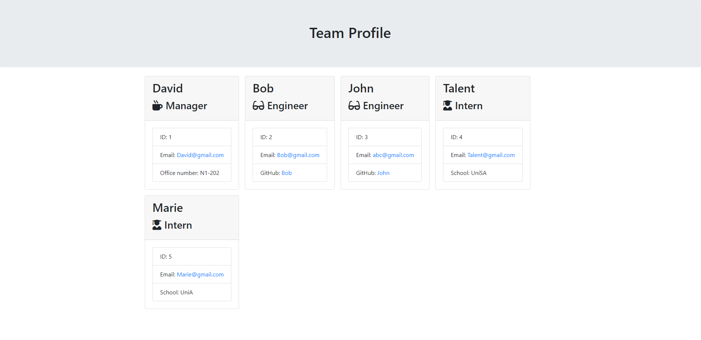

<br>
  
  ##  **Team-Profile-Generator**
  <br>
  
  Badged as [](https://opensource.org/licenses/MIT)
  <br>
    
  ###  **TABLE OF CONTENTS**

  * [Description](#description)
  * [Demo&Screenshot](#screenshot)
  * [Installation Instructions](#installation-instructions)
  * [Usage Info](#usage-info)
  * [Contribution Guidelines](#contribution-guidelines)
  * [Test Instructions](#test-instructions)
  * [License](#license)
  * [Credits](#credits)
  * [Questions](#questions)
  
  ###  **DESCRIPTION**
    
  This is a Node.js command-line application that takes in information about employees on a software engineering team, then generates an HTML webpage that displays summaries for each person.
  <br>

    #### User Story

    ```md
    AS A manager
    I WANT to generate a webpage that displays my team's basic info
    SO THAT I have quick access to their emails and GitHub profiles
    ```

    #### Acceptance Criteria

    ```md
    GIVEN a command-line application that accepts user input
    WHEN I am prompted for my team members and their information
    THEN an HTML file is generated that displays a nicely formatted team roster based on user input
    WHEN I click on an email address in the HTML
    THEN my default email program opens and populates the TO field of the email with the address
    WHEN I click on the GitHub username
    THEN that GitHub profile opens in a new tab
    WHEN I start the application
    THEN I am prompted to enter the team manager’s name, employee ID, email address, and office number
    WHEN I enter the team manager’s name, employee ID, email address, and office number
    THEN I am presented with a menu with the option to add an engineer or an intern or to finish building my team
    WHEN I select the engineer option
    THEN I am prompted to enter the engineer’s name, ID, email, and GitHub username, and I am taken back to the menu
    WHEN I select the intern option
    THEN I am prompted to enter the intern’s name, ID, email, and school, and I am taken back to the menu
    WHEN I decide to finish building my team
    THEN I exit the application, and the HTML is generated
    ```

    #### Recommended Structure
    It is recommended that the directory structure looks like the following:

    ```md
    .
    ├── __tests__/             //jest tests
    │   ├── Employee.test.js
    │   ├── Engineer.test.js
    │   ├── Intern.test.js
    │   └── Manager.test.js
    ├── dist/                  // rendered output (HTML) and CSS style sheet      
    ├── lib/                   // classes
    ├── src/                   // template helper code 
    ├── .gitignore             // indicates which folders and files Git should ignore
    ├── index.js               // runs the application
    └── package.json           
    ```  

  ###  **SCREENSHOT**

  [](./src/Screenshot-10.png)
  <br>
  [](./src/Demo.png)  

  ###  **INSTALLATION INSTRUCTIONS**
  
  Before run this app, you have to install dependencies for this application first. To do so, it's suggested to run the following command:
  <br>
  `npm i`
  <br>
  in integrated Terminal [Check as video](xxx)
  <br>

  ###  **USAGE INFO**
  
  To start the application, user need to:
  <br>
  enter node index.js in integrated Terminal
  <br>

  ###  **CONTRIBUTION GUIDELINES**
    
  It is suggested to create a new branch to do any modifications, then submit a pull request to merge.
  <br>

  ###  **TEST INSTRUCTIONS**
  
  To run tests for this application you can run the following:

  `npm run test`
  <br>

  ###  **LICENSE**
 
  This repository is licensed under the `MIT` license, which is specified as: <br>
  MIT License
  Copyright (C) <2022>  <Hongnodie> <br>
  
          Permission is hereby granted, free of charge, to any person obtaining a copy of this software and associated documentation files (the "Software"), to deal in the Software without restriction, including without limitation the rights to use, copy, modify, merge, publish, distribute, sublicense, and/or sell copies of the Software, and to permit persons to whom the Software is furnished to do so, subject to the following conditions:
          
          The above copyright notice and this permission notice shall be included in all copies or substantial portions of the Software.
          
          THE SOFTWARE IS PROVIDED "AS IS", WITHOUT WARRANTY OF ANY KIND, EXPRESS OR IMPLIED, INCLUDING BUT NOT LIMITED TO THE WARRANTIES OF MERCHANTABILITY, FITNESS FOR A PARTICULAR PURPOSE AND NONINFRINGEMENT. IN NO EVENT SHALL THE AUTHORS OR COPYRIGHT HOLDERS BE LIABLE FOR ANY CLAIM, DAMAGES OR OTHER LIABILITY, WHETHER IN AN ACTION OF CONTRACT, TORT OR OTHERWISE, ARISING FROM, OUT OF OR IN CONNECTION WITH THE SOFTWARE OR THE USE OR OTHER DEALINGS IN THE SOFTWARE.
  <br>

  ###  **CREDITS**
  
  This project was made possible with the support and collaboration of:

  Boot camp instructors
  <br>

  ###  **QUESTIONS**

  Should you have any questions or feedback about our app 
  <br>
  Please leave a message at:
  [https://github.com/Hongnodie/](https://github.com/Hongnodie/) 
  <br>
  or email to
  [92ganhong@gmail.com](mailto:92ganhong@gmail.com)
  <br>